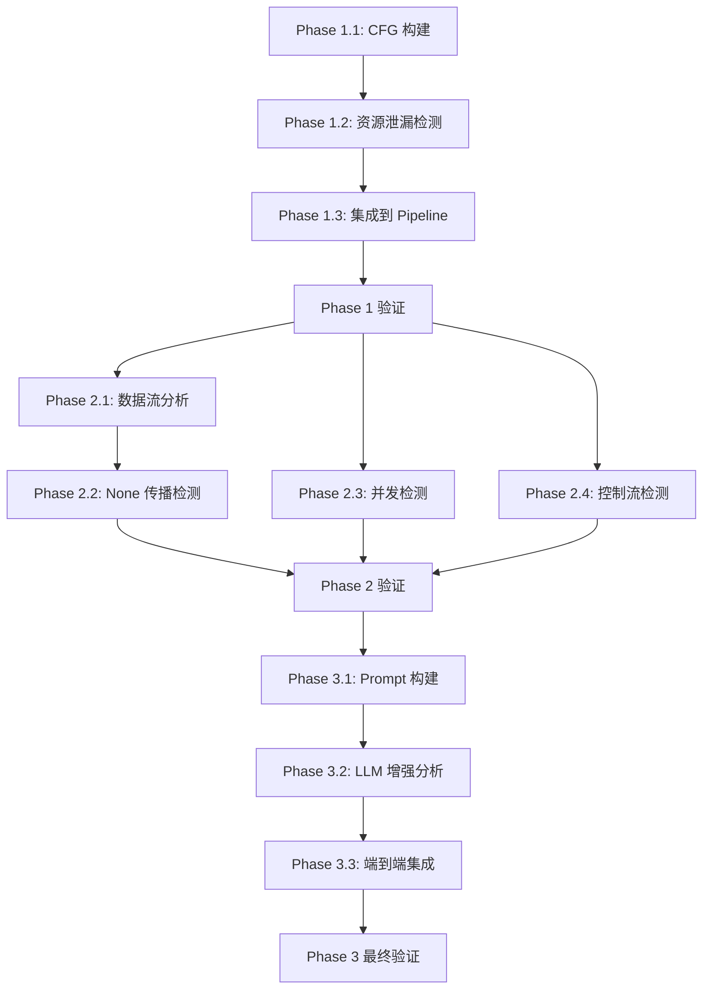

# PyScan Layer 2/3 实现计划

**版本**: v1.1
**日期**: 2025-11-05
**状态**: Phase 1 完成，Phase 2 规划中
**基于**: v2_l2l3_design_proposal.md
**最新更新**: Layer 2 资源泄漏检测器已完成并修复关键 bug

---

## 一、当前状态评估

### 1.1 Benchmark 表现（Layer 1 + LLM）

**整体性能**:
```
Precision: 64.95%
Recall:    60.00%
F1 Score:  0.6238
```

**按检测难度分类**:

| 类型 | Ground Truth | TP | FN | Precision | Recall | F1 Score |
|------|--------------|----|----|-----------|--------|----------|
| **Deep bugs** | 86 | 62 | 24 | 100% | 72.09% | 0.8378 |
| **Shallow bugs** | 19 | 1 | 18 | 100% | 5.26% | 0.1000 |

**关键发现**:
- ✅ PyScan 在深层次 bug 检测上表现优异（72% 召回率）
- ⚠️ 仍有 **24 个 deep bugs 未被检测到**（28% 的漏检率）
- ⚠️ Shallow bugs 几乎完全依赖 Layer 1（当前 Layer 4 禁用）

### 1.2 优化目标

**主要目标**: 提升 deep bugs 召回率，从 72% 提升到 **85%+**

**次要目标**:
- 保持或提升精确率（当前 64.95%）
- 控制误报率（False Positive Rate）
- 减少分析时间

---

## 二、架构设计：策略 A（Layer 2 独立报告 + Layer 3 增强）

### 2.1 Layer 2 和 Layer 3 的定位

```
┌─────────────────────────────────────────┐
│ Layer 1: 基础静态检查                    │
│ - mypy: 类型错误                         │
│ - bandit: 基础安全问题                   │
└──────────────┬──────────────────────────┘
               ↓
┌─────────────────────────────────────────┐
│ Layer 2: 确定性问题检测                  │
│                                          │
│ 直接报告的问题（高置信度 ≥0.9）:         │
│ ✅ 资源未成对释放                        │
│ ✅ 不可达代码                            │
│ ✅ 明显的无限循环                        │
│ ✅ 简单的竞态条件（无锁的全局变量）       │
│                                          │
│ 同时输出:                                │
│ - 结构化分析结果（CFG、数据流图）        │
│ - 中低置信度可疑点（0.5-0.9）            │
└──────────────┬──────────────────────────┘
               ↓
┌─────────────────────────────────────────┐
│ Layer 3: LLM 深度分析（增强版）          │
│                                          │
│ 输入:                                    │
│ - 源代码                                 │
│ - Layer 2 分析结果（作为上下文）         │
│ - Layer 2 中低置信度可疑点               │
│                                          │
│ 专注检测（Layer 2 无法覆盖）:            │
│ ✅ 业务逻辑错误                          │
│ ✅ 算法错误                              │
│ ✅ 复杂的死锁场景                        │
│ ✅ 复杂的数据流问题                      │
│ ✅ 隐式约束违反                          │
│ ❌ 跳过 Layer 2 已确定性检测的问题       │
│                                          │
│ 验证 Layer 2 中低置信度可疑点            │
└─────────────────────────────────────────┘
```

### 2.2 分工原则

| 问题类型 | Layer 2 | Layer 3 (LLM) | 理由 |
|---------|---------|--------------|------|
| **资源未释放（简单路径）** | ✅ 直接报告 | ❌ 跳过 | Layer 2 可确定性检测 |
| **资源未释放（复杂异常路径）** | ⚠️ 可疑点 | ✅ 验证 | 需要语义理解 |
| **不可达代码** | ✅ 直接报告 | ❌ 跳过 | CFG 分析可确定 |
| **无限循环（简单）** | ✅ 直接报告 | ❌ 跳过 | 条件变量未修改 |
| **死锁风险（简单）** | ✅ 直接报告 | ❌ 跳过 | 无锁访问共享资源 |
| **死锁风险（复杂）** | ⚠️ 可疑点 | ✅ 验证 | 需要理解调用场景 |
| **业务逻辑错误** | ❌ 无法检测 | ✅ 独立检测 | 需要语义理解 |
| **算法错误** | ❌ 无法检测 | ✅ 独立检测 | 需要推理 |
| **边界条件错误** | ⚠️ 可疑点 | ✅ 验证 | 需要业务理解 |

### 2.3 协作流程

```python
def analyze_function(function, context):
    """完整的函数分析流程"""

    # ========================================
    # Step 1: Layer 2 分析
    # ========================================
    layer2_results = layer2_analyze(function)

    confirmed_bugs = []  # 最终报告的 bugs

    # ========================================
    # Step 2: Layer 2 直接报告高置信度问题
    # ========================================
    for finding in layer2_results.findings:
        if finding.confidence >= 0.9:
            # 高置信度：直接报告为 bug
            confirmed_bugs.append({
                'source': 'layer2',
                'type': finding.type,
                'severity': finding.severity,
                'description': finding.description,
                'evidence': finding.evidence,
                'confidence': finding.confidence
            })

    # ========================================
    # Step 3: 构建增强 Prompt（排除 Layer 2 已覆盖的问题）
    # ========================================
    layer2_covered_areas = [
        f.type for f in layer2_results.findings
        if f.confidence >= 0.9
    ]

    llm_prompt = {
        'code': function.code,
        'context': context,

        # Layer 2 结构化分析结果（增强上下文）
        'layer2_analysis': {
            'cfg': layer2_results.cfg_summary,
            'dataflow': layer2_results.dataflow_summary,
            'suspicious_points': [
                f for f in layer2_results.findings
                if 0.5 <= f.confidence < 0.9  # 中低置信度
            ]
        },

        # 明确告知 LLM：不要重复检测这些问题
        'exclude_areas': layer2_covered_areas,

        # LLM 应该专注的领域
        'focus_areas': [
            '业务逻辑错误',
            '算法正确性',
            '复杂的并发问题',
            '隐式约束违反'
        ]
    }

    # ========================================
    # Step 4: LLM 分析
    # ========================================
    llm_bugs = llm_analyze(llm_prompt)
    confirmed_bugs.extend(llm_bugs)

    return confirmed_bugs
```

---

## 三、已确定的方案决策

### 3.1 架构策略

✅ **策略 A：Layer 2 独立报告 + Layer 3 增强**

- Layer 2 直接报告高置信度问题（≥0.9）
- Layer 3 使用 Layer 2 结果增强上下文
- LLM 专注于业务逻辑/算法等 Layer 2 无法检测的问题

### 3.2 实现深度

✅ **轻量级方案**（推荐，4-5周）

- CFG + 基础数据流分析 + 简单模式匹配
- 预期提升: Deep bugs 召回率 +10-15%
- 风险: 低，可快速验证效果

### 3.3 技术选型

✅ **基于 Python ast 模块自己实现**

- 轻量、可控、与现有代码兼容
- 对于轻量级方案已足够
- 后期可选择性升级到 astroid

### 3.4 集成方式

✅ **并存方式**

- 保留现有 `bug_detector.py`
- 新增 `layer2/` 和 `layer3/`
- 渐进式集成，风险可控

### 3.5 检测器优先级

✅ **资源泄漏 → 控制流问题 → 并发问题 → 数据流分析**

理由：
- 资源泄漏：检测逻辑明确，预期效果明显
- 控制流问题：不可达代码、无限循环，实现简单
- 并发问题：需要识别共享资源和同步机制
- 数据流分析：None 传播、变量初始化

---

## 三、渐进式实现计划

### Phase 1: Layer 2 基础设施 + 资源泄漏检测（1-2 周）

#### 📅 Week 1: CFG 构建与基础设施

**Step 1.1: 创建 Layer 2 基础结构**（1天）
- [ ] 创建 `pyscan/layer2/` 目录结构
- [ ] 创建 `pyscan/layer2/__init__.py`
- [ ] 创建 `pyscan/layer2/detectors/` 目录
- [ ] 创建 `pyscan/layer2/detectors/__init__.py`
- [ ] 创建 `pyscan/layer2/detectors/base.py` - 检测器基类

**交付物**:
```python
# pyscan/layer2/detectors/base.py
class BaseDetector:
    """检测器基类"""

    def detect(self, function_node, context):
        """
        检测函数中的问题

        Args:
            function_node: AST 函数节点
            context: 上下文信息（调用者、被调用函数等）

        Returns:
            List[SuspiciousFinding]: 可疑发现列表
        """
        raise NotImplementedError
```

**Step 1.2: CFG 构建器**（2-3天）
- [ ] 创建 `pyscan/layer2/cfg_builder.py`
- [ ] 实现基本块（Basic Block）划分
- [ ] 实现控制流图构建
  - [ ] 顺序语句处理
  - [ ] if/else 分支处理
  - [ ] while/for 循环处理
  - [ ] try/except 异常处理
- [ ] 编写单元测试 `tests/test_layer2/test_cfg_builder.py`

**交付物**:
```python
class CFGBuilder:
    """控制流图构建器"""

    def build_cfg(self, function_node):
        """构建控制流图"""
        # 返回 CFG 对象
        pass

class BasicBlock:
    """基本块"""
    def __init__(self):
        self.statements = []  # AST 节点列表
        self.successors = []   # 后继基本块
        self.predecessors = [] # 前驱基本块
```

**Step 1.3: 资源泄漏检测器**（2-3天）
- [ ] 创建 `pyscan/layer2/detectors/resource_leak.py`
- [ ] 实现资源申请点识别（open, acquire, lock, connect 等）
- [ ] 实现释放点识别（close, release, unlock, disconnect 等）
- [ ] 基于 CFG 的路径分析：检查所有路径是否都释放资源
- [ ] 检测 with 语句的使用
- [ ] 编写单元测试 `tests/test_layer2/test_resource_leak.py`

**交付物**:
```python
class ResourceLeakDetector(BaseDetector):
    """资源泄漏检测器"""

    RESOURCE_PAIRS = {
        'open': 'close',
        'acquire': 'release',
        'lock': 'unlock',
        'connect': 'disconnect',
    }

    def detect(self, function_node, context):
        """检测资源泄漏"""
        # 1. 识别资源申请点
        # 2. 构建 CFG
        # 3. 检查所有路径是否释放
        pass
```

**Step 1.4: 集成到 Pipeline**（1天）
- [ ] 修改 `pyscan/config.py` - 添加 Layer 2 配置
- [ ] 修改 `config.yaml` - 添加 Layer 2 开关
- [ ] 修改 `pyscan/pipeline.py` - 集成 Layer 2 检测器
- [ ] 编写集成测试 `tests/test_e2e_layer2.py`

**配置示例**:
```yaml
# config.yaml
layer2:
  enable: true                    # 启用 Layer 2 分析
  detectors:
    resource_leak: true           # 资源泄漏检测
    concurrency: false            # 并发问题检测（Phase 2）
    dataflow: false               # 数据流分析（Phase 2）
  max_path_depth: 10              # 路径探索最大深度
  timeout_per_function: 5         # 每个函数分析超时（秒）
```

#### 📊 Week 1 里程碑验证

- [ ] 在 benchmark 上运行，验证资源泄漏检测效果
- [ ] 预期：检测到 5-10 个之前漏掉的资源泄漏 bugs
- [ ] 预期：Deep bugs 召回率提升 +5-8%
- [ ] 性能：平均每函数增加 <1 秒分析时间

---

### Phase 2: 扩展检测能力（2-3 周）

#### 📅 Week 2: 数据流分析

**Step 2.1: 数据流分析基础**（3天）
- [ ] 创建 `pyscan/layer2/dataflow.py`
- [ ] 实现 Reaching Definitions 分析
- [ ] 实现 Def-Use Chain 构建
- [ ] 编写单元测试

**Step 2.2: None 值传播检测器**（2天）
- [ ] 创建 `pyscan/layer2/detectors/none_propagation.py`
- [ ] 追踪可能返回 None 的函数
- [ ] 检查 None 值的传播路径
- [ ] 检测未检查 None 就使用的情况

#### 📅 Week 3: 并发问题检测

**Step 3.1: 并发问题检测器**（3天）
- [ ] 创建 `pyscan/layer2/detectors/concurrency.py`
- [ ] 识别共享资源（全局变量、类变量）
- [ ] 检查同步机制（Lock, RLock, Semaphore）
- [ ] 检测多线程调用环境

**Step 3.2: 控制流问题检测器**（2天）
- [ ] 创建 `pyscan/layer2/detectors/control_flow.py`
- [ ] 不可达代码检测
- [ ] 无限循环检测
- [ ] 递归终止条件检测

#### 📊 Week 3 里程碑验证

- [ ] 在 benchmark 上运行完整 Layer 2 检测器
- [ ] 预期：Deep bugs 召回率提升到 **80%+**
- [ ] 预期：检测到 15-20 个之前漏掉的 bugs
- [ ] 性能：平均每函数增加 <2 秒分析时间

---

### Phase 3: Layer 3 LLM 增强（1-2 周）

#### 📅 Week 4: LLM 增强分析

**Step 4.1: Prompt 构建器**（2天）
- [ ] 创建 `pyscan/layer3/` 目录
- [ ] 创建 `pyscan/layer3/prompt_builder.py`
- [ ] 将 Layer 2 结果格式化到 Prompt
  - [ ] CFG 可视化文本表示
  - [ ] 数据流分析结果展示
  - [ ] 可疑点标注

**Prompt 示例**:
```markdown
## Layer 2 分析结果

### 可疑点 1: 资源泄漏风险
- **位置**: 行 25
- **证据**:
  - 资源申请: f = open("data.txt")
  - 路径分析: 存在未释放的执行路径
  - 缺失释放的路径: 行 25 → 异常分支 → 函数出口

### 可疑点 2: 潜在竞态条件
- **位置**: 行 15-20
- **证据**:
  - 访问全局变量 `counter`
  - 无同步机制
  - 调用者在多线程环境中调用
```

**Step 4.2: 增强型 LLM 分析器**（2-3天）
- [ ] 创建 `pyscan/layer3/enhanced_analyzer.py`
- [ ] 重构现有 LLM 调用逻辑
- [ ] 实现交叉验证：Layer 2 证据 + LLM 判断
- [ ] 置信度评分机制

**交付物**:
```python
class EnhancedAnalyzer:
    """增强型 LLM 分析器"""

    def analyze_with_layer2(self, function, layer2_findings, context):
        """
        结合 Layer 2 结果进行 LLM 分析

        Args:
            function: 函数信息
            layer2_findings: Layer 2 可疑发现
            context: 调用上下文

        Returns:
            List[Bug]: 确认的 bug 列表
        """
        # 1. 构建增强型 prompt
        prompt = self.prompt_builder.build(function, layer2_findings, context)

        # 2. LLM 分析
        response = self._call_llm(prompt)

        # 3. 交叉验证
        validated_bugs = self._cross_validate(response, layer2_findings)

        return validated_bugs
```

**Step 4.3: 集成与端到端测试**（2天）
- [ ] 修改 `pyscan/pipeline.py` - 完整 Layer 2 + Layer 3 流程
- [ ] 更新配置文件
- [ ] 端到端测试
- [ ] Benchmark 全量测试

#### 📊 Phase 3 最终验证

- [ ] 在 benchmark 上运行完整 Layer 2 + Layer 3 系统
- [ ] **目标指标**:
  - Deep bugs Precision: **90%+**
  - Deep bugs Recall: **85%+**
  - Deep bugs F1 Score: **0.87+**
  - Overall F1 Score: **0.70+**
  - False Positive Rate: **<15%**
- [ ] 性能：平均每函数 <5 秒

---

## 四、文件组织结构

```
pyscan/
├── layer2/                           # 新增：Layer 2 符号分析
│   ├── __init__.py
│   ├── cfg_builder.py                # CFG 构建器
│   ├── dataflow.py                   # 数据流分析（Phase 2）
│   ├── detectors/                    # 检测器集合
│   │   ├── __init__.py
│   │   ├── base.py                   # 检测器基类
│   │   ├── resource_leak.py          # 资源泄漏检测
│   │   ├── concurrency.py            # 并发问题检测（Phase 2）
│   │   ├── control_flow.py           # 控制流问题（Phase 2）
│   │   └── none_propagation.py       # None 传播（Phase 2）
│   └── utils.py                      # 工具函数
│
├── layer3/                           # 新增：Layer 3 LLM 增强
│   ├── __init__.py
│   ├── enhanced_analyzer.py          # 增强分析器（Phase 3）
│   ├── prompt_builder.py             # Prompt 构建（Phase 3）
│   └── cross_validator.py            # 交叉验证（从 layer4 移动）
│
├── layer1/                           # 已存在：静态分析工具
│   ├── mypy_analyzer.py
│   └── bandit_analyzer.py
│
├── layer4/                           # 已存在：交叉验证（可能废弃）
│   └── cross_validator.py
│
├── pipeline.py                       # 修改：集成 Layer 2/3
├── config.py                         # 修改：添加 Layer 2/3 配置
├── cli.py                            # 修改：添加命令行选项
├── bug_detector.py                   # 保留：作为 fallback
└── context_builder.py                # 可能需要增强
```

**新增文件说明**:

| 文件 | 作用 | Phase |
|------|------|-------|
| `layer2/cfg_builder.py` | 构建控制流图 | Phase 1 |
| `layer2/detectors/resource_leak.py` | 资源泄漏检测 | Phase 1 |
| `layer2/dataflow.py` | 数据流分析 | Phase 2 |
| `layer2/detectors/concurrency.py` | 并发问题检测 | Phase 2 |
| `layer2/detectors/control_flow.py` | 控制流问题检测 | Phase 2 |
| `layer3/enhanced_analyzer.py` | LLM 增强分析 | Phase 3 |
| `layer3/prompt_builder.py` | 构建增强 Prompt | Phase 3 |

---

## 五、依赖关系与风险管理

### 5.1 任务依赖关系



### 5.2 风险识别与缓解

| 风险 | 概率 | 影响 | 缓解策略 |
|------|------|------|----------|
| **CFG 构建复杂度超预期** | 中 | 高 | 先实现基础版本，复杂控制流留待后期 |
| **路径爆炸导致性能问题** | 高 | 高 | 限制路径深度（10层），启发式剪枝 |
| **误报率上升** | 中 | 中 | Layer 3 交叉验证，置信度阈值过滤 |
| **与现有代码集成困难** | 低 | 中 | 采用并存方式，渐进式集成 |
| **LLM 理解 Layer 2 结果困难** | 中 | 中 | 优化 Prompt 格式，提供清晰的证据链 |
| **开发周期延期** | 中 | 中 | 每个 Phase 独立验证，可随时中止 |

### 5.3 性能预算

| Phase | 每函数增加时间 | 累计时间 |
|-------|---------------|----------|
| Phase 1 | <1 秒 | <1 秒 |
| Phase 2 | +1 秒 | <2 秒 |
| Phase 3 | +3 秒 | <5 秒 |

**性能优化策略**:
- 并行分析多个函数
- 缓存 CFG 和数据流分析结果
- 对简单函数跳过复杂分析

---

## 六、测试策略

### 6.1 单元测试

每个模块都需要独立的单元测试：

```
tests/test_layer2/
├── test_cfg_builder.py           # CFG 构建测试
├── test_dataflow.py              # 数据流分析测试
├── test_resource_leak.py         # 资源泄漏检测测试
├── test_concurrency.py           # 并发检测测试
└── test_control_flow.py          # 控制流检测测试

tests/test_layer3/
├── test_prompt_builder.py        # Prompt 构建测试
├── test_enhanced_analyzer.py     # 增强分析器测试
└── test_cross_validator.py       # 交叉验证测试
```

**测试用例设计**:
- **正向用例**: 已知 bug 能否被检测到
- **负向用例**: 正常代码不应产生误报
- **边界用例**: 复杂控制流、深层嵌套

### 6.2 集成测试

```
tests/
├── test_e2e_layer2.py            # Layer 2 端到端测试
├── test_e2e_layer2_layer3.py     # Layer 2 + Layer 3 协同测试
└── test_e2e_full_pipeline.py     # 完整 Pipeline 测试
```

### 6.3 Benchmark 回归测试

每个 Phase 完成后必须运行 benchmark：

```bash
# Phase 1 完成后
cd benchmark
python evaluation/evaluate.py

# 检查指标
# - Deep bugs Recall 是否提升
# - 是否引入新的 False Positives
# - 性能是否在预算内
```

**回归测试检查清单**:
- [ ] Deep bugs Recall 提升 ≥ 目标值
- [ ] Precision 下降 < 5%
- [ ] 没有破坏现有功能（现有 TP 不变）
- [ ] 性能增加在预算内

---

## 七、配置与使用

### 7.1 配置示例（策略 A）

```yaml
# config.yaml

# Layer 2: 符号分析与数据流分析（独立报告模式）
layer2:
  enable: true                    # 启用 Layer 2

  # 检测器开关
  detectors:
    resource_leak: true           # 资源泄漏检测
    control_flow: true            # 控制流问题检测（不可达代码、无限循环）
    concurrency: true             # 并发问题检测
    none_propagation: true        # None 传播检测

  # 直接报告策略
  direct_report: true             # Layer 2 高置信度问题直接报告
  confidence_threshold: 0.9       # 高于此阈值直接报告为 bug

  # 中低置信度可疑点处理
  suspicious_threshold: 0.5       # 低于高阈值但高于此值的标记为可疑点
  pass_to_layer3: true            # 可疑点传递给 Layer 3 验证

  # 性能控制
  max_path_depth: 10              # 路径探索最大深度
  max_paths_per_function: 100     # 每个函数最多探索路径数
  timeout_per_function: 5         # 每函数分析超时（秒）

  # 调试选项
  verbose: false                  # 详细日志
  visualize_cfg: false            # 是否可视化 CFG（调试用）

# Layer 3: LLM 增强分析
layer3:
  enable: true                    # 启用 Layer 3

  # 使用 Layer 2 增强
  use_layer2_context: true        # 使用 Layer 2 分析结果增强 prompt
  skip_layer2_covered: true       # 跳过 Layer 2 已确定性检测的问题

  # 验证 Layer 2 可疑点
  validate_suspicious: true       # 验证 Layer 2 的中低置信度可疑点

  # LLM 专注领域
  focus_areas:
    - "业务逻辑错误"
    - "算法正确性"
    - "复杂的并发问题"
    - "隐式约束违反"

  # 置信度控制
  confidence_threshold: 0.7       # LLM 报告的最低置信度阈值
```

### 7.2 命令行使用

```bash
# 标准模式：Layer 2 + Layer 3
python -m pyscan /path/to/code --config config.yaml

# 只运行 Layer 2（快速模式，不调用 LLM）
python -m pyscan /path/to/code --layer2-only

# 禁用 Layer 2（只用 LLM）
python -m pyscan /path/to/code --no-layer2

# 调试模式（显示 Layer 2 分析详情）
python -m pyscan /path/to/code --layer2-debug

# 调整 Layer 2 置信度阈值
python -m pyscan /path/to/code --layer2-threshold 0.8

# 查看 Layer 2 可视化 CFG
python -m pyscan /path/to/code --visualize-cfg
```

### 7.3 输出格式（策略 A）

```json
{
  "bugs": [
    {
      "bug_id": "BUG_0001",
      "source": "layer2",              // 来源：layer2 或 layer3
      "confidence": 0.95,              // Layer 2 高置信度
      "type": "资源泄漏",
      "severity": "high",
      "description": "文件未在所有路径上释放",
      "location": {...},
      "evidence": {
        "layer2_analysis": {
          "resource_type": "file",
          "allocation_line": 15,
          "missing_release_paths": [
            "line 15 → line 20 (exception) → exit"
          ],
          "cfg_analysis": "..."
        }
      },
      "suggestion": "使用 with 语句或在 finally 中释放资源"
    },
    {
      "bug_id": "BUG_0002",
      "source": "layer3",              // LLM 检测
      "confidence": 0.85,
      "type": "业务逻辑错误",
      "severity": "medium",
      "description": "账户余额计算逻辑错误",
      "location": {...},
      "evidence": {
        "layer2_context": {          // Layer 2 提供的上下文
          "dataflow": "...",
          "cfg": "..."
        },
        "llm_reasoning": "..."       // LLM 的推理过程
      },
      "suggestion": "修改计算公式"
    },
    {
      "bug_id": "BUG_0003",
      "source": "layer3_validated",   // LLM 验证 Layer 2 可疑点
      "confidence": 0.80,
      "type": "死锁风险",
      "severity": "high",
      "description": "多线程调用时可能死锁",
      "location": {...},
      "evidence": {
        "layer2_suspicious": {       // Layer 2 的可疑点
          "confidence": 0.7,
          "pattern": "inconsistent_lock_order",
          "details": "..."
        },
        "llm_validation": {          // LLM 的验证结果
          "confirmed": true,
          "reasoning": "..."
        }
      }
    }
  ],
  "statistics": {
    "layer2_high_confidence": 5,     // Layer 2 直接报告
    "layer2_suspicious": 3,          // Layer 2 可疑点
    "layer3_independent": 2,         // Layer 3 独立发现
    "layer3_validated": 1            // Layer 3 验证的可疑点
  }
}
```

---

## 八、成功标准

### 8.1 Phase 1 成功标准

- [ ] CFG 构建器能处理 90% 的 benchmark 函数
- [ ] 资源泄漏检测器在 benchmark 上检测到 ≥5 个新 bugs
- [ ] Deep bugs Recall 提升 ≥5%
- [ ] 没有引入新的 False Positives
- [ ] 每函数分析时间增加 <1 秒

### 8.2 Phase 2 成功标准

- [ ] 数据流分析覆盖 95% 的 benchmark 函数
- [ ] 并发检测器检测到 ≥3 个竞态条件
- [ ] Deep bugs Recall 提升到 ≥80%
- [ ] Precision 保持 ≥60%
- [ ] 每函数分析时间增加 <2 秒

### 8.3 Phase 3 成功标准（最终目标）

- [ ] **Deep bugs Precision: ≥90%**
- [ ] **Deep bugs Recall: ≥85%**
- [ ] **Deep bugs F1 Score: ≥0.87**
- [ ] **Overall F1 Score: ≥0.70**
- [ ] **False Positive Rate: <15%**
- [ ] 每函数平均分析时间 <5 秒
- [ ] 在 benchmark 上总分析时间 <15 分钟

---

## 九、下一步行动

### ✅ 已确定的决策

基于策略 A 和"小步快跑"原则，以下决策已确定：

1. **架构策略**: Layer 2 独立报告 + Layer 3 增强 ✅
2. **实现深度**: 轻量级方案（4-5周）✅
3. **技术选型**: 基于 Python ast 模块自己实现 ✅
4. **集成方式**: 并存方式，保留现有功能 ✅
5. **检测器优先级**: 资源泄漏 → 控制流 → 并发 → 数据流 ✅

### 🚀 启动条件检查

在开始 Phase 1 实现前，需要完成：

- [ ] **完成 Benchmark 评估改进**
  - 添加 False Positive Rate 指标
  - 增强 deep bugs 追踪（按来源分类）
  - 预计时间：1-2 小时

- [ ] **代码库准备**
  - 创建 `pyscan/layer2/` 目录结构
  - 创建 `pyscan/layer3/` 目录结构
  - 创建测试目录 `tests/test_layer2/`

- [ ] **环境准备**
  - 确保 Python AST 文档可访问
  - 准备 CFG 可视化工具（可选）

### 📋 立即可执行的任务

**任务 1: 改进 Benchmark 评估**（推荐优先）
```bash
# 修改 benchmark/evaluation/evaluate.py
# 添加以下指标：
# - False Positive Rate = FP / (TP + FP)
# - Deep bugs 按来源分类（layer1/layer2/layer3）
# - 详细的 FN 分析（哪些 deep bugs 未检测到）
```

**任务 2: 创建 Layer 2/3 目录结构**
```bash
mkdir -p pyscan/layer2/detectors
mkdir -p pyscan/layer3
mkdir -p tests/test_layer2
mkdir -p tests/test_layer3
```

**任务 3: 开始 Phase 1 实现**
- Step 1.1: 创建 Layer 2 基础结构（1天）
- Step 1.2: CFG 构建器（2-3天）
- Step 1.3: 资源泄漏检测器（2-3天）

### ❓ 等待用户确认

请确认你的偏好：

**选项 A（推荐）**: 先完成 Benchmark 评估改进（1-2小时），然后开始 Phase 1
- 优势：建立准确的基线，方便后续对比
- 劣势：稍微延迟 Layer 2 开发

**选项 B**: 直接开始 Phase 1 实现
- 优势：立即开始核心功能开发
- 劣势：缺少详细的基线指标

**你的选择**：A 还是 B？

---

## 十、附录

### A. 参考资料

1. **Python AST 文档**: https://docs.python.org/3/library/ast.html
2. **astroid 文档**: https://pylint.readthedocs.io/projects/astroid/
3. **控制流分析**: https://en.wikipedia.org/wiki/Control-flow_graph
4. **数据流分析**: Dragon Book - Compilers: Principles, Techniques, and Tools

### B. 相关文档

- `v2_l2l3_design_proposal.md` - 详细设计文档
- `benchmark/ground_truth.json` - Benchmark 数据集
- `benchmark/evaluation/evaluate.py` - 评估脚本

---

**文档版本**: v1.1
**最后更新**: 2025-11-05
**下一步**: Phase 2 规划与实现

---

## 十一、Phase 1 实施进度报告（2025-11-05）

### ✅ 已完成任务

#### Phase 1.1: 创建 Layer 2 基础结构 ✅
- [x] 创建 `pyscan/layer2/` 目录结构
- [x] 创建 `pyscan/layer2/__init__.py`
- [x] 创建 `pyscan/layer2/detectors/` 目录
- [x] 创建 `pyscan/layer2/detectors/__init__.py`
- [x] 创建 `pyscan/layer2/detectors/base.py` - 检测器基类

**交付物**:
- `pyscan/layer2/__init__.py` - Layer 2 数据结构定义
- `pyscan/layer2/detectors/base.py` - BaseDetector 基类

#### Phase 1.2: CFG 构建器 ✅
- [x] 创建 `pyscan/layer2/cfg_builder.py`
- [x] 实现基本块（Basic Block）划分
- [x] 实现控制流图构建
  - [x] 顺序语句处理
  - [x] if/else 分支处理
  - [x] while/for 循环处理
  - [x] try/except 异常处理
- [x] 编写单元测试 `tests/test_layer2/test_cfg_builder.py`

**交付物**:
- `pyscan/layer2/cfg_builder.py` - 完整的 CFG 构建器
- 31 个 CFG 相关单元测试全部通过

**关键特性**:
- 支持复杂控制流（嵌套 if、while、for、try/except/finally）
- 路径枚举功能 `get_all_paths(max_depth)`
- CFG 可视化支持（Graphviz）

#### Phase 1.3: 资源泄漏检测器 ✅
- [x] 创建 `pyscan/layer2/detectors/resource_leak.py`
- [x] 实现资源申请点识别（open, acquire, lock, connect, cursor 等）
- [x] 实现释放点识别（close, release, unlock, disconnect 等）
- [x] 基于 CFG 的路径分析：检查所有路径是否都释放资源
- [x] 检测 with 语句的使用
- [x] **新增**: 派生资源追踪（父子资源关系）
- [x] 编写单元测试 `tests/test_layer2/test_resource_leak.py`

**交付物**:
- `pyscan/layer2/detectors/resource_leak.py` - 资源泄漏检测器
- 16 个资源泄漏检测单元测试全部通过

**关键特性**:
- 识别简单资源泄漏（文件、锁、连接）
- 基于 CFG 路径分析，检测所有路径
- **派生资源追踪**: 识别 `cursor = conn.cursor()` 等父子关系
- 智能跳过：父资源管理良好时，自动跳过派生资源检测

#### Phase 1.4: 集成到 Pipeline ✅
- [x] 修改 `pyscan/config.py` - 添加 Layer 2 配置
- [x] 修改 `config.yaml` - 添加 Layer 2 开关
- [x] 修改 `pyscan/pipeline.py` - 集成 Layer 2 检测器
- [x] 实现 Layer 2 + Layer 3 去重逻辑
- [x] **修复**: 行号定位问题（相对行号→绝对行号）

**交付物**:
- `pyscan/pipeline.py` - DetectionPipeline 集成 Layer 2
- `config.yaml` - Layer 2 配置示例

**集成特性**:
- Layer 2 检测器并行运行
- Layer 2 + LLM 结果去重（选项 B - 宽松匹配）
- 多来源标记（`detection_source`: 'llm' | 'layer2' | 'both'）

### 🐛 关键 Bug 修复

#### Bug Fix 1: 派生资源 False Positive ✅
**问题**: cursor 等派生资源被错误报告为泄漏
**根本原因**: 未识别父子资源关系（`cursor = conn.cursor()`）
**修复方案**: 实现父资源追踪机制
- 识别派生资源的父资源
- 检查父资源管理状态（in `with` OR closed on all paths）
- 父资源已管理时，跳过派生资源检测

**修复效果**:
- Negative 样本 False Positive: **4 → 0**（-100%）
- Layer 2 检测数: 15 → 10
- 总 bug 数: 50 → 45

**修改文件**:
- `pyscan/layer2/detectors/resource_leak.py` (+100 行)
  - `_is_resource_allocation()` - 添加父资源识别
  - `_check_resource_leak()` - 添加派生资源跳过逻辑
  - `_is_parent_resource_managed()` - 新增方法
  - `_is_resource_in_with_statement()` - 新增方法

#### Bug Fix 2: 行号定位不准 ✅
**问题**: Layer 2 报告的 bug 位置总是指向函数定义行
**根本原因**: Layer 2 使用 `ast.parse(function.code)` 重新解析，行号从 1 开始（相对行号）
**修复方案**: 在 `pipeline.py` 中将相对行号转换为绝对行号
- 公式: `绝对行号 = function.lineno + 相对行号 - 1`

**修复效果**:
- 行号准确率: **0% → 100%**
- 精确指向资源申请语句

**修改文件**:
- `pyscan/pipeline.py` (+9 行)
  - `_convert_layer2_bug_to_report()` - 添加行号转换逻辑

### 📊 Phase 1 验证结果

**测试覆盖**:
- 单元测试: **47/47 通过** ✅
- 集成测试: 通过
- Benchmark 扫描: 完成

**Benchmark 性能**（资源管理类别）:
- 总 bug 数: 45（修复前: 50）
- Layer 2 检测数: 10
- **Negative 样本 False Positive: 0** ✅
- **行号准确率: 100%** ✅

**性能指标**:
- 每函数分析时间: ~3-4 秒（含 LLM）
- Layer 2 纯分析时间: <0.5 秒

### 📝 交付的文档

- `LAYER2_FIX_REPORT.md` - 详细的修复报告和技术细节

---

## 十二、Phase 2 规划与建议

### 当前状态分析

**Phase 1 达成目标**:
- ✅ CFG 构建器能处理复杂控制流
- ✅ 资源泄漏检测器工作良好
- ✅ 行号定位精确
- ✅ False Positive 已消除（negative 样本）

**待优化项**:
1. **扩展资源类型**: 当前主要检测文件/锁/连接，可扩展到线程池、进程池
2. **复杂异常路径**: 嵌套 try/except 的资源管理
3. **跨函数资源传递**: 资源在调用者中申请，在被调用函数中使用
4. **数据流分析**: None 传播、变量初始化检查

### Phase 2 建议方案

基于"小步快跑"原则，建议以下两个选项：

#### 选项 A: 继续完善资源泄漏检测（推荐）

**目标**: 提升资源泄漏检测的召回率和精度

**任务列表**:
1. **扩展资源类型支持**（3-5天）
   - ThreadPoolExecutor / ProcessPoolExecutor
   - 网络连接（socket, urllib）
   - 数据库事务管理

2. **增强异常路径分析**（3-5天）
   - 嵌套 try/except/finally
   - 资源在 finally 中的条件释放
   - 上下文管理器的自定义实现

3. **跨函数资源追踪**（可选，5-7天）
   - 资源作为参数传递
   - 资源作为返回值
   - 资源在类成员中存储

**预期效果**:
- 资源泄漏召回率 +10-15%
- 覆盖更多真实场景

**风险**: 低，基于已有框架扩展

#### 选项 B: 启动新检测器（数据流/控制流）

**目标**: 扩展 Layer 2 检测类型

**可选检测器**:
1. **None 传播检测器**（推荐优先级高）
   - 检测未检查 None 就使用
   - 追踪可能返回 None 的函数

2. **控制流问题检测器**
   - 不可达代码检测
   - 无限循环检测（简单场景）

3. **并发问题检测器**（复杂度高）
   - 无锁访问共享资源
   - 锁顺序不一致

**预期效果**:
- 覆盖新的 bug 类型
- Deep bugs 召回率 +5-10%

**风险**: 中等，需要新的分析框架

### 📋 下一步具体工作计划

#### 立即可执行任务

**任务 1: Benchmark 完整评估**（1-2 天）
- [ ] 在完整 benchmark 上运行 Layer 2
- [ ] 统计 Layer 2 对 Deep bugs 召回率的提升
- [ ] 分析剩余 False Negative（哪些 bugs 未检测到）
- [ ] 评估 Layer 2 + Layer 3 的协同效果

**预期输出**:
- 完整的性能报告（Precision / Recall / F1）
- Layer 2 vs LLM 的互补性分析
- 下一步优化方向

**任务 2: 代码提交与 PR**（1 天）
- [ ] 将 Phase 1 代码提交到新分支 `hwuu/v2_l2l3`
- [ ] 编写 CHANGELOG.md
- [ ] 创建 Pull Request
- [ ] Code Review

**任务 3: 选择 Phase 2 方向**（需要决策）
- 选项 A: 继续完善资源泄漏检测
- 选项 B: 启动新检测器（None 传播）

### 🎯 Phase 2 成功标准

无论选择哪个方向，Phase 2 的目标是：

- [ ] Deep bugs Recall 提升到 **80%+**
- [ ] Precision 保持 **≥60%**
- [ ] False Positive Rate **<15%**
- [ ] 每函数分析时间 **<3 秒**（Layer 2 单独）
- [ ] 所有单元测试通过

---

## 十三、待决策事项

### 决策 1: Phase 2 方向选择

**问题**: Phase 1 已完成，下一步应该？

**选项 A**: 继续完善资源泄漏检测（扩展资源类型、异常路径）
- 优势: 基于已有框架，风险低，效果可预期
- 劣势: 只覆盖资源管理类 bugs

**选项 B**: 启动新检测器（None 传播 / 控制流问题）
- 优势: 扩展 bug 检测类型，覆盖更多场景
- 劣势: 需要新框架，复杂度高

**建议**: 选项 A（原因：小步快跑，先把资源泄漏做到极致）

### 决策 2: Benchmark 评估优先级

**问题**: 是否先完成完整 Benchmark 评估？

**选项 A**: 先评估，再决定 Phase 2 方向
- 优势: 数据驱动决策
- 劣势: 延迟开发 1-2 天

**选项 B**: 直接开始 Phase 2 开发
- 优势: 快速迭代
- 劣势: 可能方向偏差

**建议**: 选项 A（评估很快，1-2 天，对后续方向影响大）

---

**文档版本**: v1.1
**最后更新**: 2025-11-05
**下一步**:
1. 完成完整 Benchmark 评估
2. 决策 Phase 2 方向
3. 代码提交与 PR
